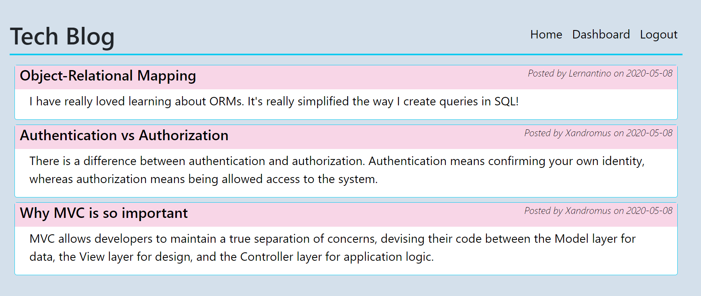
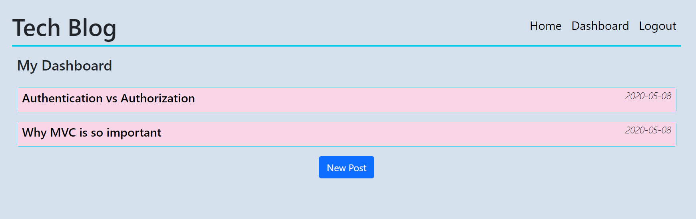

# Tech Blog 

## Description

Tech Blog is a full-stack project that follows the Model-View-Controller paradigm that allows users to create an account to publish articles, blog posts, and thoughts and opinions. Every post can also be commented by other users. Users without an account can still view posts, but are not allowed to add their own posts or comments.\
This project is part of a challenge from Full Stack Coding Bootcamp at the University of Minnesota.

## Installation

If you wish to run this application locally, please use `https://nodejs.org/en/` to install Node.js (version 16 is recommended).\
Run `npm i` in the terminal to install dependencies bcrypt, connect-session-sequelize, dotenv, Express, Express-handlebars, Express-session, Handlebars, MySQL2 and Sequelize and Nodemon.

## Usage

1. If you wish to view posts and/or add your own:
    * Open `https://bia-jorgensen-tech-blog.herokuapp.com/` to see the homepage. 
    * Here you can see all the posts that have been posted, if any. 
    * To add your own posts or add comments to existing posts, you will need to login or signup if you do not have a profile yet. 
    * After you are signed in, click on 'Dashboard' on the navbar to see your own posts or add a new post.
    * Click on your own post to edit or delete it. 
    * In the Homepage, click on an existing post to add a comment or to see all existing comments for that post, if any. 
    * To finish your session, click 'Logout' on the navbar.  

1. If you wish to run this application locally:
    1. Clone this project's repository to local machine by using SSH Key `git@github.com:BiaJorgensen/tech-blog.git`
    1. Use .env.EXAMPLE to enter your MySQL username and password (remane file to remove .EXAMPLE)
    1. To create the database:
        * In the command line (CLI), navigate to db folder
        * Type `mysql -u root -p`
        * Enter your password
        * Type `SOURCE schema.sql`
    1. To seed data to the database:
        * In the CLI, type `npm run seed`
    1. To connect to server:
        * In the CLI, type `npm i` to guarantee dependencies are installed
        * Type `npm start`
        * Open `http://localhost:3001/` on your browser to see the application
        

## Credits

N/A

## License

The license for this project is **The MIT License** 
To learn more about this license, please access https://opensource.org/licenses/MIT

## Website preview
<kbd></kbd>
<kbd></kbd>

## Questions
Visit my GitHub profile page: https://github.com/BiaJorgensen 
If you have additional questions, please send an email to souzabeatriz17@gmail.com